## From economics to data science for government : a (long) journey

## My story (in short)

1. Graduate/PhD Student in Economics at PSE/CREST
1. Data journalist at Ask Media
1. Data scientist at Etalab

## Grad student at PSE in … 2005/2007 { .fullpage }

## I was interested in 

1. applied econometrics/evaluation of public policies
1. labor economics/economics of education
1. political economy
1. ... 

## Sources of inspiration 

* Joshua Angrist : IV models, etc
* Charles Manski : *Identification problems for the social sciences*
* Eric Maurin : 
* Andrew Gelman : 
* Gary King : developing statistical methodes but also software !

## My research

## Teaching was a great experience

* I've been teaching at Cachan : 
* econometrics
* statistics
* game theory
* decision theory
* growth theory
* It's a great experience

## Why did I not finished py Phd ?

* too curious, not enough focus.
* without deadline, procrastination can be infinite !
* isolation : I wanted to learn by myself, instead of asking others.

## 3 tips for not giving up your doctorate

* stay focus on your research/papers. Don't be too curious.
* learn from others/ don't try to learn everything by yourself
* do things you can do. Don't try to do what you can't do.

# There is a life out of the lab

Econometrics use data but around 2012, many other fields use data :

* emerging field of data science / data in the business life 
* data journalism
* open data : civic use of data

## How to find a job when you leave research

* Attend meetups : data tuesdays
* Attend hackathons/open data camps 
* Participate to non profit organization : Open knowledge foundation
* Write emails to interesting people and meet them

## What is data journalism ?

## Social science on deadline ? {.fullpage}

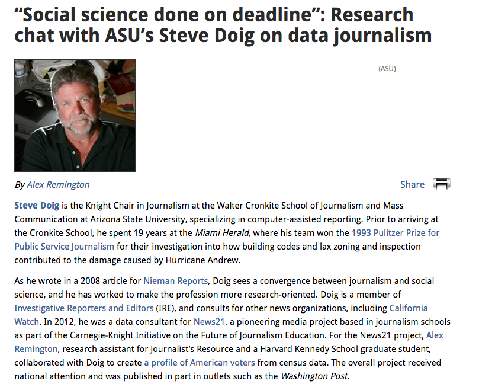

## The new punk ? {.fullpage}

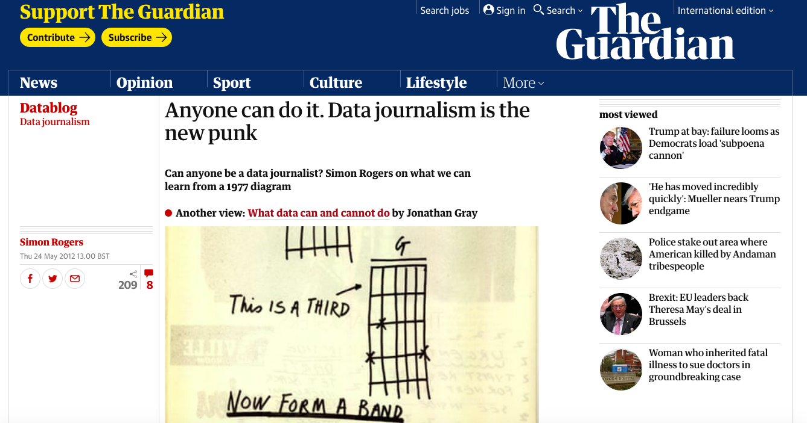

## What is data journalism ? (last)

* Using data to produce meaningful facts for the media
* Go beyond anecdotal information
* Tell data stories using data visualisation

## How I got hired in 1/2 hour without applying for any job offer

> Hi, I'm interested in what you do. I'd be happy to talk with you.

* After 1/2 hour discussing with Ask Media team, they offered me a job.
* I had my first employment contract without ever applying for a job offer !

## What was Ask Media ?

* a media agency working with newspapers such as Le Parisien, Paris Match, La Tribune, etc
* a small team of journalists, graphists, web developers
* specialized in : infographics, data visualisation, data journalism and explainers.

## What have we done at Ask Media ?

## {.fullpage}

## {.fullpage}

## {.fullpage}

## {.fullpage}

## {.fullpage}

## {.fullpage}

## {.fullpage}

## {.fullpage}

## {.fullpage}

## Inspiring figures in the field of dataviz / datajournalism 

* Mike Bostock and [The Upshot](https://www.nytimes.com/interactive/2015/04/22/upshot/happy-birthday-upshot.html)
* [Emile Cheysson](https://fr.wikipedia.org/wiki/%C3%89mile_Cheysson) : unknown French pionneer 
* Edward Tufte : *[The Visual Display of Quantitative Information](https://www.edwardtufte.com/tufte/books_vdqi)* 
* John Burn-Murdoch (FT Interactive) : [Visual vocabulary](http://ft-interactive.github.io/visual-vocabulary/)

# Next step : data scientist at Etalab 

## What is Etalab ? (in short)
  
* French government's open data team 
* but also : open government
* and ... data science team

## What is a data scientist ?

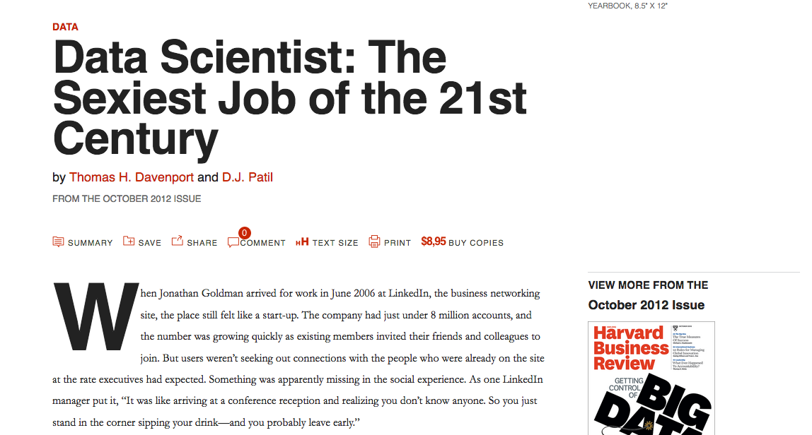

## What is a data scientist ?

> Data scientists want to build things, not just give advice. One describes being a consultant as “the dead zone.”

Thomas H. Davenport and D.J. Patil 

## What is a data scientist in the government ?

* Using a predictive algorithm to improve the probability to find illegaly converted buildings
* [MODA 2013 Annual report](https://civicio.files.wordpress.com/2016/07/annual_report_2013.pdf)

## What do we do at Etalab ? 

* Open data 
* Data governance/data policy
* Data science and artificial intelligence for the public sector

## { .fullpage }

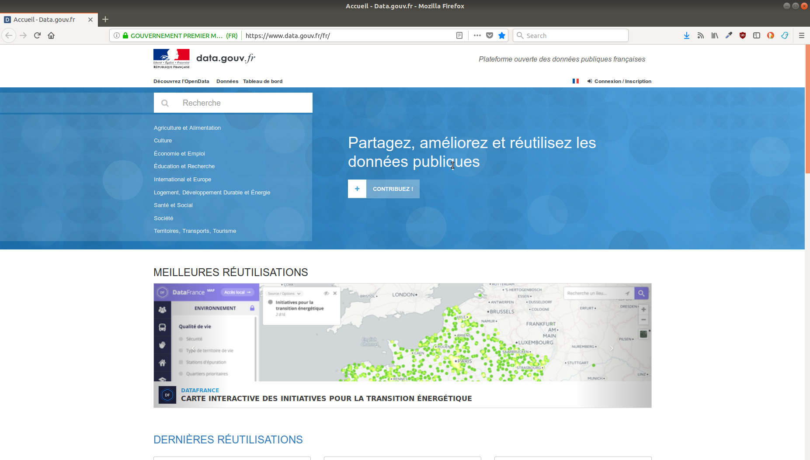

## { .fullpage }

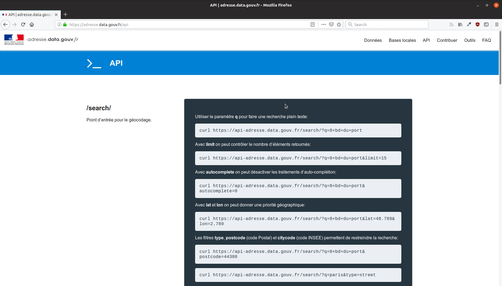
 
## { .fullpage }

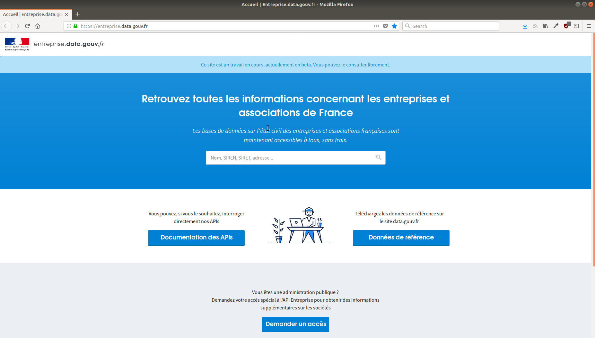
 
## The data governance report 

### 3 axes for data policy

* producing high quality key datasets
* improving data flow while respecting confidentiality
* using data to improve public action

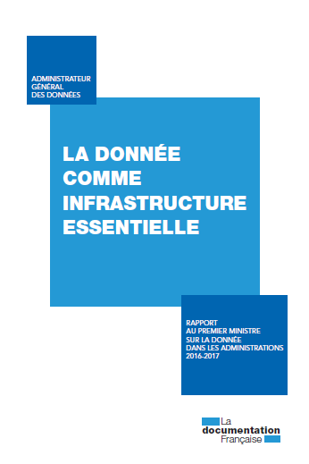

## What are our ways of acting?

1. **maker way** : develop products and tools
1. **legal way** : drafting the law, defining a policy
1. **people way** : supporting public administration and working with the civil society

## Producing high quality key datasets

Giving  legal recognition to « reference data » (Digital Republic Act, 2016) 

9 key datasets that are critical for the society and economy, including :
  
* Company Register (Sirene),
* Land Register (Cadastre),
* National adresses database,
* National directory of associations

## { .fullpage }

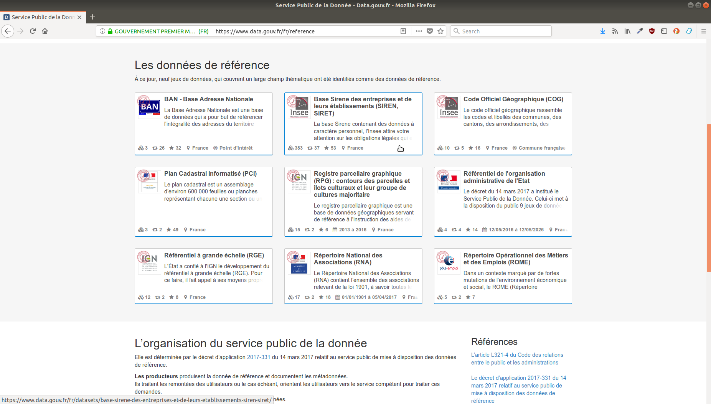
  
## Improving data flow
  
### Legal way
  
* *Free access to public data has now become the rule*. Exceptions to this principle are now very strictly regulated.  
* The Digital Republic Act (2016) has considerably expanded the range of administrative documents available online, moving from release on demand to *open data by default* (effective in 2018)

  
## { .fullpage }
  

  
## using data to improve public action
  
## { .fullpage }
  

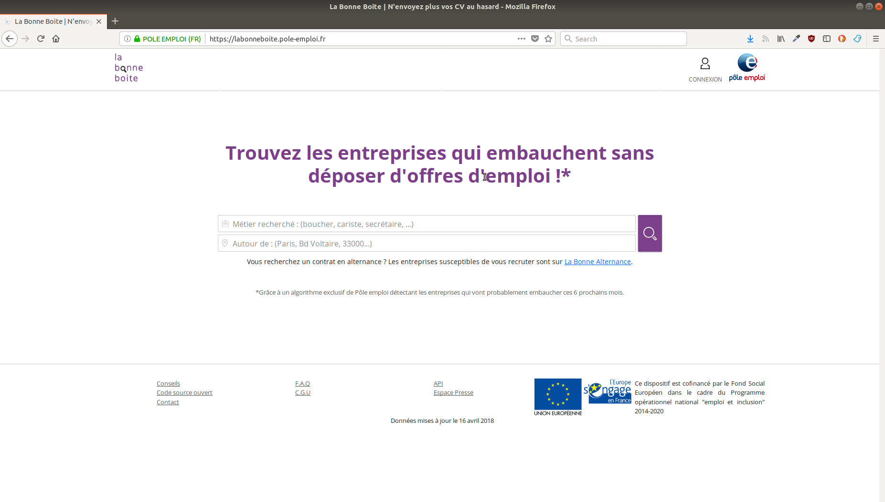

  
## { .fullpage }
  

  
## { .fullpage }
  

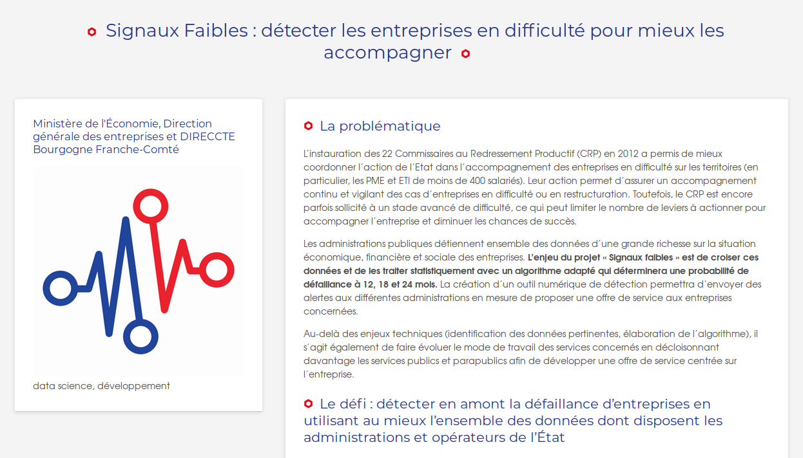

  
## { .fullpage }

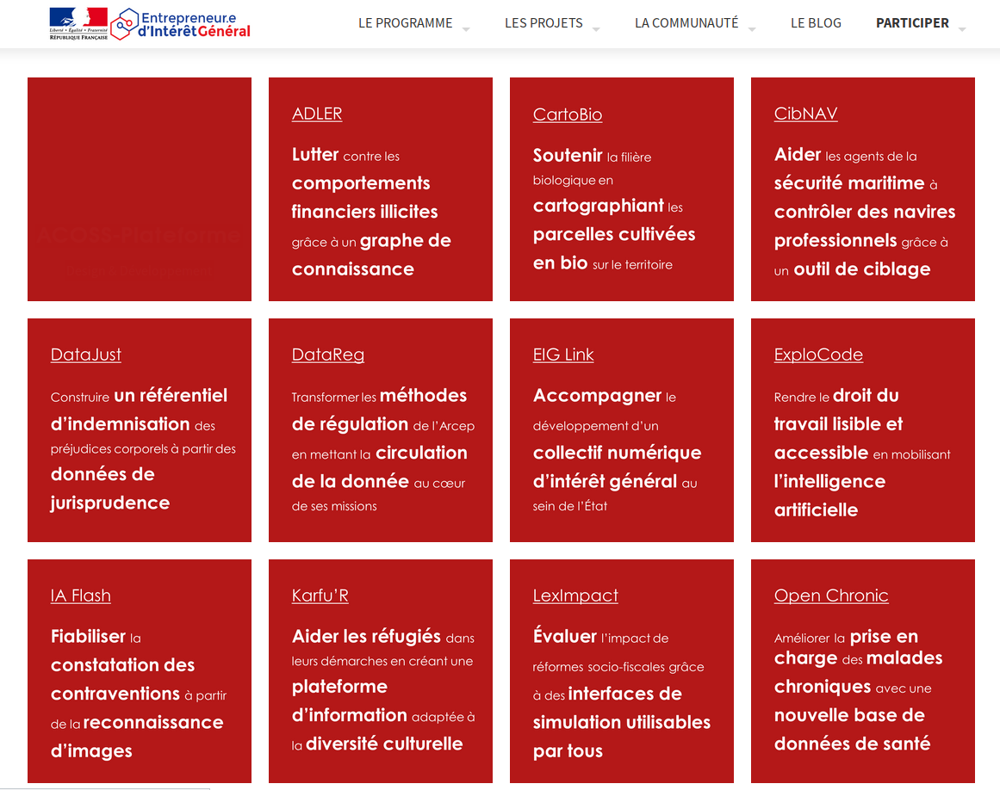

  
## { .fullpage }
  

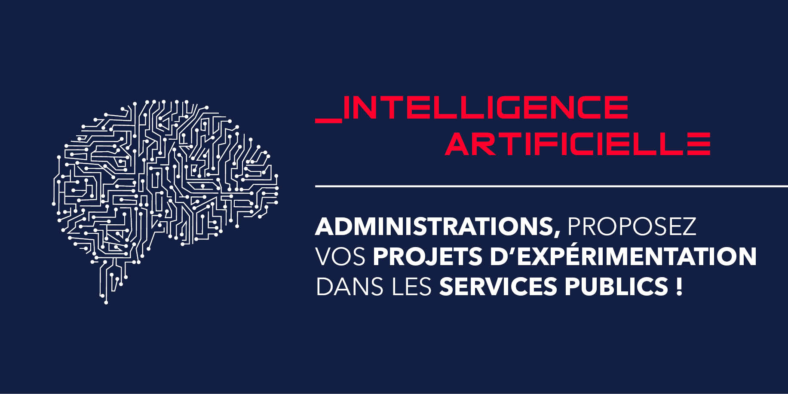

  
## Why is it so nice to work at Etalab ?

1. People are autonomous : we have a great freedom in what we do
1. People who are not afraid to learn : we are not specialists of everything but we are willing to learn
1. People have values : many of us are engaged in free knowledge, open data movement, etc
1. People are willing to debate together, learn from others, etc : many discussions inside of the team

## Why is it so nice to work at Etalab ?

1. Everyone has specific skills : data science, full stack development, legal skills
1. But everyone do much more than its area of expertise

## { .fullpage }

## See more
  
### Twitter : https://twitter/pa_chevalier
### mail : pachevalier@gmail.com
### Github : http://github.com/pachevalier
